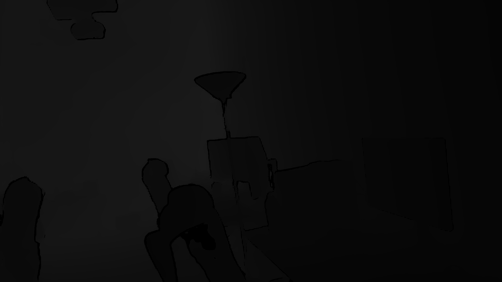
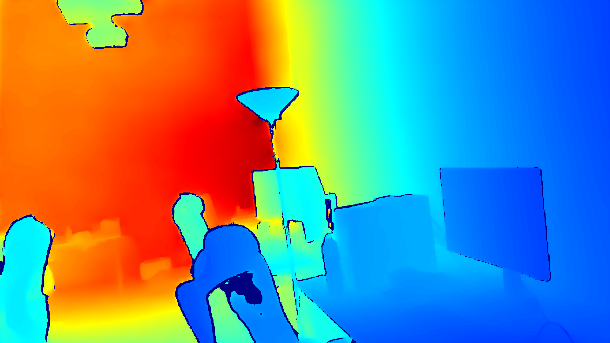
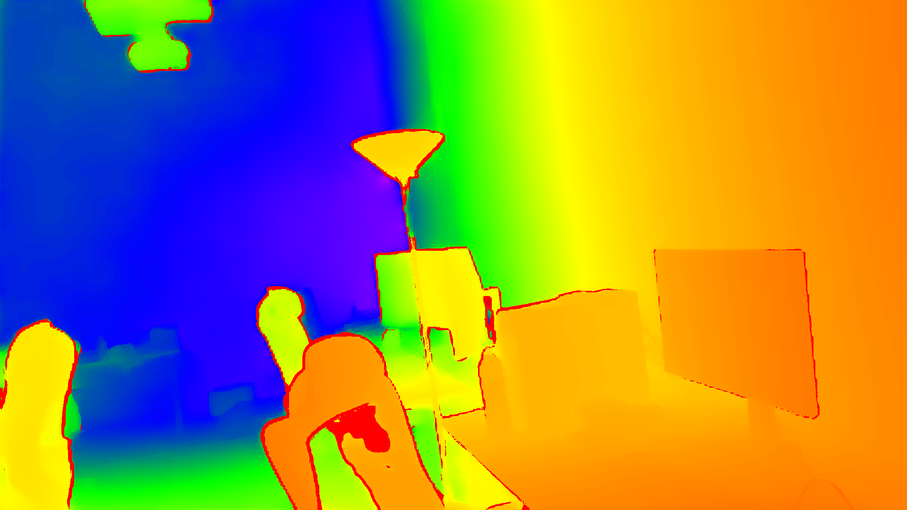

# Depth Inspector

A generic repository for depth map inspection.

# UINT8 Depth Image
An **8-bit depth image** is typically stored using an **unsigned 8-bit integer** data type, also known as **`uint8`**. Here’s a breakdown of its properties:

### Properties of `uint8` Depth Image

- **Range**: `0` to `255`
- **Data Type**: `uint8` (8-bit unsigned integer)
- **Precision**: No decimal places, as it only stores whole numbers within this range

### Limitations for Depth Maps

The limited range of `0–255` is quite restrictive for depth data because:

- **Range is Extremely Limited**: `uint8` only covers **256 possible values**. This is usually insufficient for representing meaningful depth data across even small ranges, as it severely limits the measurable distances.
- **Precision Loss**: When used for depth maps, `uint8` images lose a lot of precision compared to `uint16` or `float32`. For example, if you store depths in millimeters, you could only measure up to **255 mm** (25.5 cm) with a 1 mm resolution.
  
Because of these limitations, `uint8` depth images are rarely used in applications requiring accurate depth representation. When they are used, they’re typically **scaled versions of the depth data** for visualization purposes, such as for applying **colormaps** to display the depth image as a **heatmap**.

### Typical Use of `uint8` for Depth
To represent larger depth ranges with `uint8`, the depth values are often **normalized** to fit within `0–255`. This sacrifices depth accuracy but allows visual representation in applications where precise depth isn’t necessary. 

### Summary

- **uint8**: Not suitable for accurate depth storage, due to its limited range and precision.
- **Common Use**: Mostly used for visualizations after normalizing the depth data to fit within `0–255`.
  
For depth data storage, **`uint16` or `float32`** are generally preferred over `uint8` due to their significantly larger ranges and precision.


<div align="center">
  
  
</div>

<div align="center">
  
  
</div>

# UINT16 Depth Image
For `uint16` (16-bit unsigned integer) depth images, the range and precision are limited compared to `float32`. Here’s what you need to know:

### Range of `uint16`
- **Minimum value**: `0`
- **Maximum value**: `65535`

This range allows `uint16` images to store depth values from `0` up to `65535`. 

### Precision of `uint16`
- `uint16` values are **integer-based**, so there are no decimal places. Each value is a whole number within the range `0–65535`.
- The precision depends on the scale or units used in the depth map:
  - If values represent **millimeters** (mm), then `65535` mm is the maximum depth that can be represented, which is approximately **65.5 meters**.
  - If values represent **centimeters** (cm), the maximum depth is around **655.35 meters**.
  - If values represent **meters** (m), the maximum depth is **65535 meters**.

### Practical Use of `uint16` for Depth Maps
The choice of scale (mm, cm, or m) determines the depth precision:
- **Millimeters** (mm): Commonly used with `uint16` depth maps. It provides depth measurements up to **65.5 meters** with a **1 mm resolution**.
- **Centimeters** (cm): Can store depths up to **655.35 meters** with a **1 cm resolution**.
- **Meters** (m): Allows for very large ranges up to **65535 meters**, but only with a **1 meter resolution**, which is too coarse for most applications.

### Comparison with `float32`
- **Range**: `float32` can represent a vastly larger range than `uint16`.
- **Precision**: `float32` can store fractional values, while `uint16` can only store integer values, which means `float32` is more suitable for applications that need very fine precision.

### Summary
`uint16` depth maps are commonly used in depth sensors because they provide a good balance of range and precision, especially when depths are stored in millimeters:
- Range up to **65.5 meters** with **1 mm precision** if using millimeters as the unit.
- Limited compared to `float32`, which can represent much larger depths and fractional precision. 

So, `uint16` depth maps are ideal when working with depth values within **65.5 meters** and when precision down to **1 mm** is sufficient.

# Float32 Depth Image
The `float32` format, or 32-bit floating-point format, can represent a very large range of values, making it suitable for storing depth data with high precision. Here’s a breakdown of the range and precision it can handle:

### Range of `float32`
- **Smallest positive value**: Approximately \(1.4 \times 10^{-45}\) (close to zero).
- **Largest positive value**: Approximately \(3.4 \times 10^{38}\).

This means `float32` can hold depth values from extremely small (almost zero) to very large values, which is far more than what typical depth sensors require. For most practical purposes, you can comfortably store depths in the range of centimeters, meters, kilometers, or even astronomical distances, if needed.

### Precision of `float32`
- `float32` has **23 bits of precision for the mantissa** (significant digits), which means it can represent values with about **7 decimal digits of precision**.
- This is more than sufficient for depth measurements in most applications, especially when measuring distances in meters with precision down to millimeters or finer. 

### Practical Range for Depth Maps
In typical applications:
- **Indoor Depth Sensing**: Ranges from about `0.3 meters` (300 mm) to around `10 meters`, depending on the sensor. `float32` can handle these depths with high precision.
- **Outdoor or Long-range Depth Sensing**: Can go up to hundreds or thousands of meters. `float32` can still handle these ranges accurately.

For instance, if you store depths in **meters**, `float32` can represent values down to sub-millimeter precision up to distances of several kilometers with acceptable accuracy.

### Why Use `float32` for Depth Maps?
- **Precision**: It allows for sub-millimeter precision, which is useful when storing depth values in meters.
- **Range**: It can represent a wide range of depths, making it versatile for various applications without the need for scaling.

### Summary
`float32` is capable of holding any practical depth value you might need, with sufficient precision for most applications.

# UINT16 vs FLOAT32 Depth Maps
The differences between `uint16` and `float32` depth maps, along with an example to illustrate how they differ in representing depth values.

### Overview of Depth Map Types

1. **`uint16` Depth Map**:
   - `uint16` is an unsigned 16-bit integer format, which means it can store integer values between `0` and `65535`.
   - Typically used when depth is stored in **millimeters** for higher resolution within this range. For example, a depth value of `1000` represents `1000 mm`, or `1 meter`.
   - Since it’s an integer type, it cannot store decimal values, so there’s no fractional depth measurement.

2. **`float32` Depth Map**:
   - `float32` is a 32-bit floating-point format, which can store a much broader range of values, including fractional (decimal) values.
   - Typically used when depth is stored in **meters** for precision. For example, a depth value of `1.234` represents `1.234 meters`, or `1234 mm`.
   - The precision allows for more accurate depth measurements, especially at smaller scales.

### Example Comparison

Consider a depth map where we measure distances in both `uint16` and `float32` formats:

#### Original Depth Values (in Meters)

Let’s say we have three pixel values representing depth:

| Pixel Position | Depth (Meters) |
|----------------|----------------|
| (100, 100)     | 1.234          |
| (150, 150)     | 5.678          |
| (200, 200)     | 10.123         |

#### Storing as `float32` Depth Map (Meters)

With `float32`, these values can be stored directly:

| Pixel Position | Depth Value (`float32`) |
|----------------|-------------------------|
| (100, 100)     | 1.234                   |
| (150, 150)     | 5.678                   |
| (200, 200)     | 10.123                  |

These values can represent distances in meters precisely, retaining decimal values.

#### Converting to `uint16` Depth Map (Millimeters)

If we convert these values to millimeters and store them as `uint16`, we need to multiply by `1000` (to convert meters to millimeters) and round to the nearest integer, as shown below:

| Pixel Position | Depth Value (`float32` in Meters) | Converted to Millimeters | Depth Value (`uint16`) |
|----------------|-----------------------------------|---------------------------|-------------------------|
| (100, 100)     | 1.234                             | 1234                      | 1234                    |
| (150, 150)     | 5.678                             | 5678                      | 5678                    |
| (200, 200)     | 10.123                            | 10123                     | 10123                   |

When stored as `uint16`, the depth map has values like `1234`, `5678`, and `10123`, which represent depths in millimeters. Note that we lose any values beyond millimeter precision.

#### Differences in Representation

1. **Precision**: `float32` retains decimal precision (e.g., `1.234 meters`), whereas `uint16` rounds to the nearest integer millimeter (e.g., `1234 mm`).
2. **Range**: `uint16` is limited to a maximum value of `65535` mm (or 65.535 meters). If your depth values exceed this, they would be clipped. `float32` can represent values far beyond this range, allowing for larger depths.
3. **File Size**: `uint16` depth maps are more compact in terms of file size compared to `float32`, as they use half the storage space per pixel (16 bits vs. 32 bits).

### Practical Use Cases

- **`uint16` Depth Maps**: Commonly used for depth sensors that measure within a limited range, like indoor scenes where distances are within `0–65 meters` and where millimeter precision is sufficient.
- **`float32` Depth Maps**: Useful in applications needing high precision, such as 3D reconstruction, where small depth differences matter, or in outdoor scenes where depth values can exceed `65 meters`.

#### Code Example

Here’s a simple example that demonstrates both types:

```python
import numpy as np

# Example depth map in meters (float32)
depth_map_float32 = np.array([[1.234, 5.678, 10.123]], dtype=np.float32)
print("Depth map in float32 (meters):")
print(depth_map_float32)

# Convert to uint16 (millimeters)
depth_map_uint16 = (depth_map_float32 * 1000).astype(np.uint16)
print("\nDepth map in uint16 (millimeters):")
print(depth_map_uint16)

# Convert back to float32 to interpret as meters (for comparison)
depth_map_reconstructed = depth_map_uint16.astype(np.float32) / 1000
print("\nReconstructed float32 depth map (meters):")
print(depth_map_reconstructed)
```

This example shows how the values are represented differently, and converting back can give approximate results but without the original precision if it was clipped.

# Process of PNG files storing depth images

PNG images can store `uint16` values but **cannot** natively store `float32` values. Here’s a breakdown:

### `uint16` in PNG
- **Supported**: PNG files can store `uint16` values (16-bit grayscale), and many image processing libraries (like OpenCV, Pillow, and imageio) can read and write these images.
- **Use Case**: `uint16` PNG images are often used for depth maps, where values are stored in millimeters or other integer-based depth values.
- **File Size**: `uint16` values are compact, requiring 2 bytes per pixel, making them efficient for storage.

### `float32` in PNG
- **Not Supported Natively**: PNG does not natively support `float32` values, as it’s designed to store integer values (typically `uint8` or `uint16` for grayscale images).
- **Workarounds**:
  - **Normalization**: Convert `float32` values to a range that fits within `uint16` or `uint8` by scaling (e.g., map a range of depths to `0–65535` for `uint16`). This approach reduces precision and range but allows storage in a PNG format.
  - **Alternative Formats**: For storing `float32` depth maps, alternative formats like `.exr` (OpenEXR) or `.tiff` (if it supports `float32`) are often used, as these formats natively support floating-point data.

### Example Workflow
For a `float32` depth map to be stored as a PNG, normalize it to fit within a `uint16` range:

```python
import numpy as np
import cv2

# Example float32 depth map with values in meters
depth_map_float32 = np.array([[1.234, 5.678, 10.123]], dtype=np.float32)

# Normalize to fit uint16 (assuming max depth value is 20 meters for this example)
normalized_depth_map = (depth_map_float32 / 20 * 65535).astype(np.uint16)

# Save as uint16 PNG
cv2.imwrite('depth_uint16.png', normalized_depth_map)
```

Then, when reading back, convert it to `float32` by reversing the normalization:

```python
# Read back the uint16 PNG
loaded_depth_map = cv2.imread('depth_uint16.png', cv2.IMREAD_UNCHANGED)

# Convert back to float32 (assuming same max depth as above)
depth_map_float32_reconstructed = (loaded_depth_map.astype(np.float32) / 65535) * 20
```

### Summary
- **PNG** supports **`uint16`** but not **`float32`** natively.
- **Alternative formats like OpenEXR or TIFF** are more suitable for **`float32`** depth data.
- **Normalization** is required if you need to store `float32` values in a `uint16` PNG.
